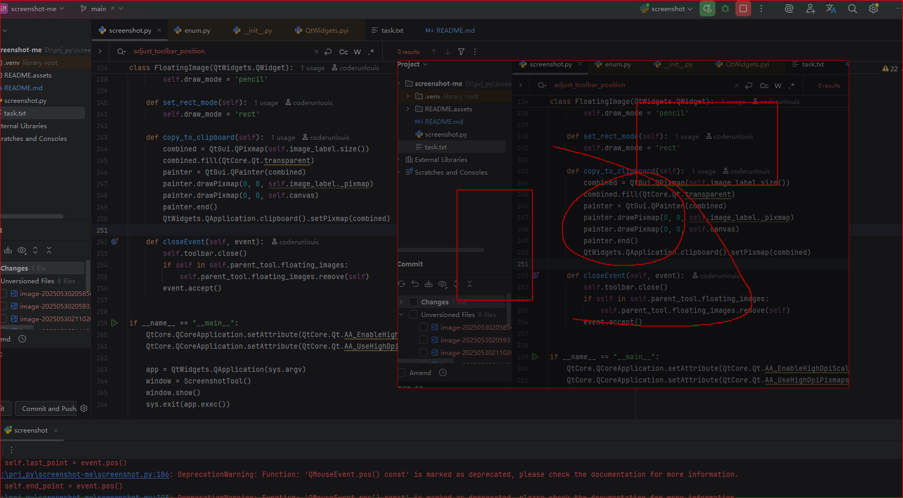

## ✅ 功能点总览 / Feature Summary

### 1. 📸 截图功能 / Screenshot Feature

| 中文描述               | English Description                             |
| ---------------------- | ----------------------------------------------- |
| 点击按钮后进入截图模式 | Enter screenshot mode after clicking the button |
| 鼠标拖动选择截图区域   | Select screenshot area by dragging mouse        |
| 自动识别当前屏幕并截图 | Automatically detect current screen and capture |
| 使用 mss 实现高效截图  | Use `mss` for efficient screen capture          |

After startup, a software interface pops up with a screenshot button. 

Clicking the button, I can select the area on the screen. 

After the selection is complete,

The selection area is pinned to the top layer of the screen by default, with a red border.

Clicking on the pinned image on the screen allows you to drag it, 

and right clicking on the image allows you to choose to destroy it.

------

### 2. 📌 钉图功能 / Pin-to-Desktop Image

| 中文描述                           | English Description                              |
| ---------------------------------- | ------------------------------------------------ |
| 截图后将图片以窗口形式“钉”在屏幕上 | Pin captured image as floating window on desktop |
| 图片可拖动，窗口置顶无边框         | Draggable, frameless, always-on-top window       |

------

### 3. 🖱️ 右键菜单功能 / Right-click Context Menu

| 中文描述                             | English Description                                 |
| ------------------------------------ | --------------------------------------------------- |
| 右键图片显示菜单                     | Right-click on pinned image to open menu            |
| 「绘制」：进入绘图模式               | "Draw": Enter drawing mode                          |
| 「取消绘制」：退出绘图模式           | "Cancel Draw": Exit drawing mode                    |
| 「复制图片」：复制当前图片（含绘图） | "Copy Image": Copy image with drawings to clipboard |
| 「销毁图片」：关闭该图片窗口         | "Destroy Image": Close and remove image window      |

------

### 4. ✏️ 绘图模式 / Drawing Mode

| 中文描述                       | English Description                         |
| ------------------------------ | ------------------------------------------- |
| 可在图片上绘制标注内容         | Draw annotations directly on the image      |
| 支持铅笔工具绘制自由线条       | Pencil tool for freehand drawing            |
| 支持矩形工具绘制矩形框         | Rectangle tool for drawing boxes            |
| 绘图内容实时显示并叠加在原图上 | Real-time drawing overlay on original image |
| 绘图状态下禁止拖动图片窗口     | Disables moving image while in drawing mode |

------

### 5. 🛠️ 绘图工具栏 / Drawing Toolbar

| 中文描述                             | English Description                                          |
| ------------------------------------ | ------------------------------------------------------------ |
| 工具栏显示在图片左侧，不遮挡图像     | Toolbar shown to the left of image without blocking content  |
| 包含“铅笔”、“矩形”、“取消绘制”按钮   | Includes buttons: Pencil, Rectangle, Cancel Draw             |
| 工具栏随图片移动自动调整位置         | Toolbar follows image and repositions correctly              |
| 第一次绘制时自动延迟定位修复显示位置 | Auto-correct toolbar position on first draw using delayed positioning |

------

### 6. 📋 复制功能 / Copy to Clipboard

| 中文描述                                | English Description                                |
| --------------------------------------- | -------------------------------------------------- |
| 可复制截图及绘制内容到系统剪贴板        | Copy the image (with drawings) to system clipboard |
| 粘贴到 Word、微信等支持图像粘贴的程序中 | Paste into Word, WeChat, Paint, etc.               |

------

## 🔧 技术关键词 / Technical Keywords

| 中文关键词            | English Keywords                     |
| --------------------- | ------------------------------------ |
| PySide6 截图工具      | PySide6 Screenshot Tool              |
| mss 多屏幕截图        | Multi-monitor capture with `mss`     |
| QLabel 悬浮窗显示图片 | Floating image with `QLabel`         |
| QMenu 右键菜单        | `QMenu` context menu                 |
| QPainter 图像绘制     | Drawing with `QPainter`              |
| QPixmap 图层叠加      | Layer merging with `QPixmap`         |
| QClipboard 图像复制   | Copy to clipboard using `QClipboard` |
| QTimer 工具栏定位优化 | Position toolbar using `QTimer`      |

